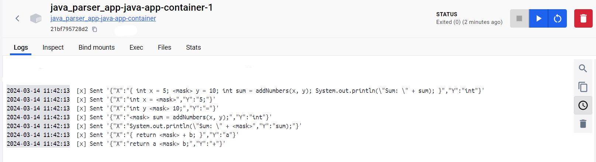

# Mascheratura e Valutazione del codice java con un modello di MLM

L’elaborato sviluppato si concentra su come applicare concretamente un modello di Masked Language Model (MLM) , realizzando due micro-servizi
che comunicano tra di loro. L'obiettivo principale è quello di progettare e implementare due servizi autonomi, in grado di interagire in maniera asincrona. Questi servizi saranno
dedicati alla manipolazione e all’analisi di codice sorgente Java,utilizzando modelli di Masked Language Models per la predizione di porzioni oscure di
codice.

# Istruzioni
Ogni micro-servizio ha il proprio file Dockerfile, l'intero ambiente è orchestrato dal file docker-compose.yml.

 ### build docker-compose.yml file
```bash
docker compose build
```

### run docker-compose.yml file
```bash
docker compose up
```

Il file Sorgente.txt nella cartella producer conterrà il codice java che sarà analizzato.

# Demo

## producter shell


## consumer shell

